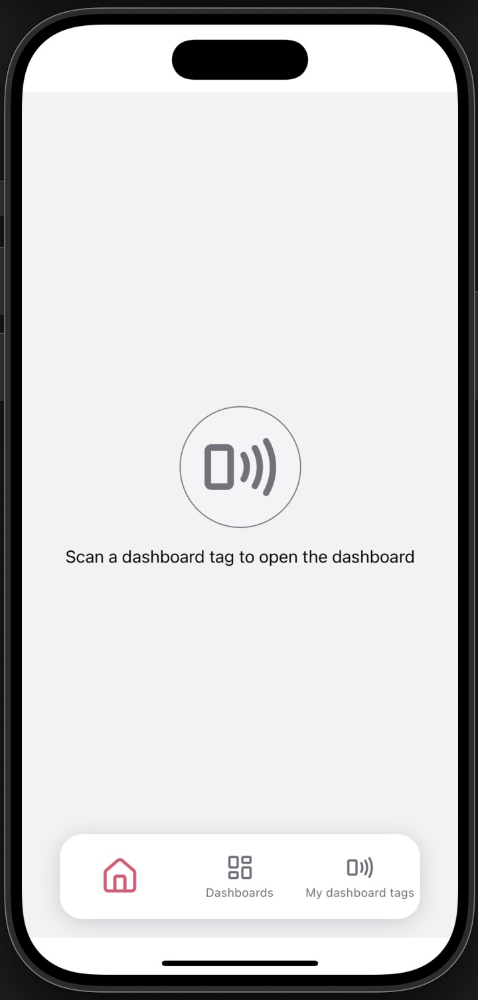
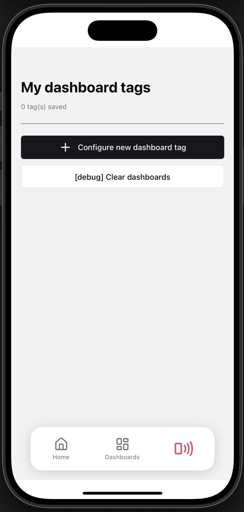
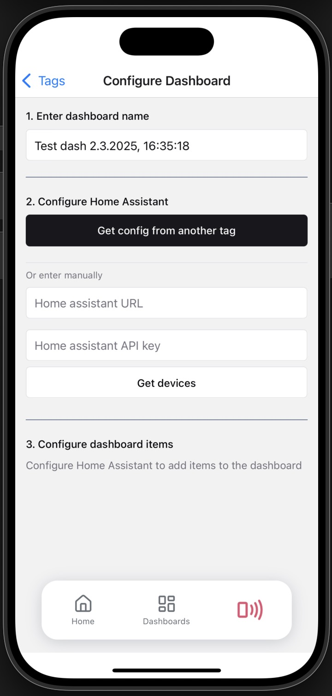

# Welcome to nfc-home-assistant 👋

## Goal

This is an [Expo](https://expo.dev) project created by [Dan](https://www.linkedin.com/in/dan-pina-794a801a9/) and [Haydn](https://www.linkedin.com/in/haydn-morris/) as a fun side-project for Haydn's house. The goal was to allow guests access to some devices in his home by scanning an NFC tag with this app, which grants them access to pre-selected devices in his [Home Assistant](https://www.home-assistant.io/) network.







## Get started

1. Install dependencies

   ```bash
   npm install
   ```

2. Start the app

   ```bash
    npx expo start
   ```
